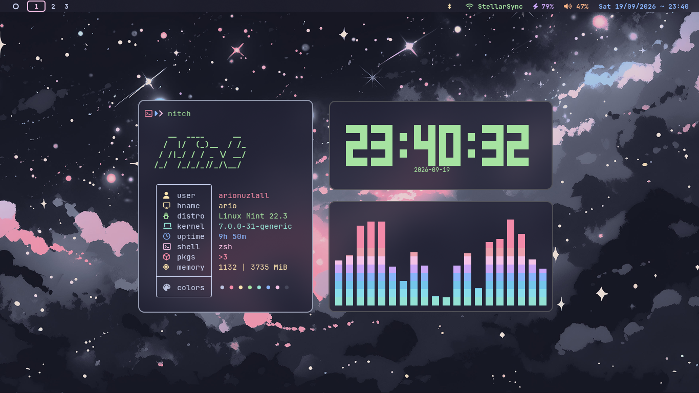
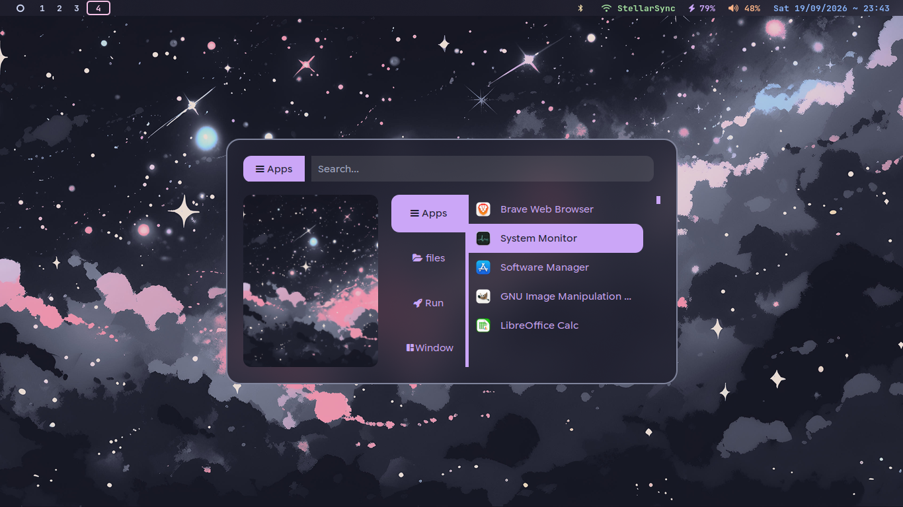
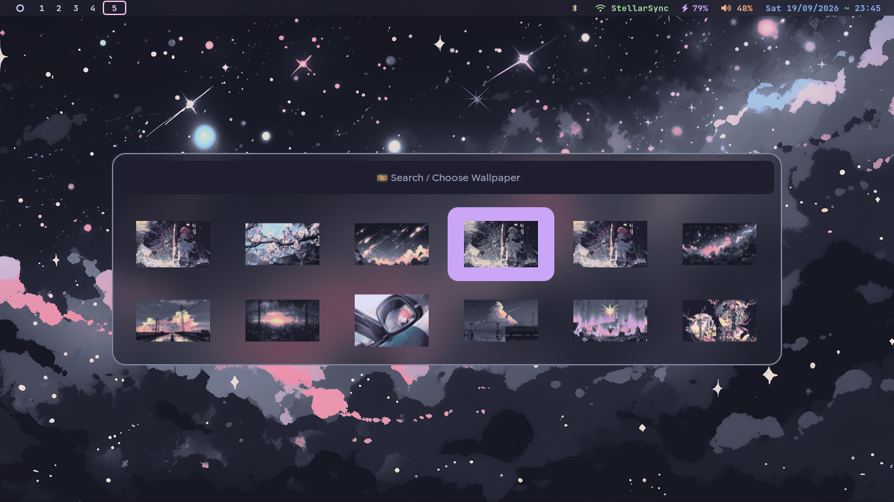
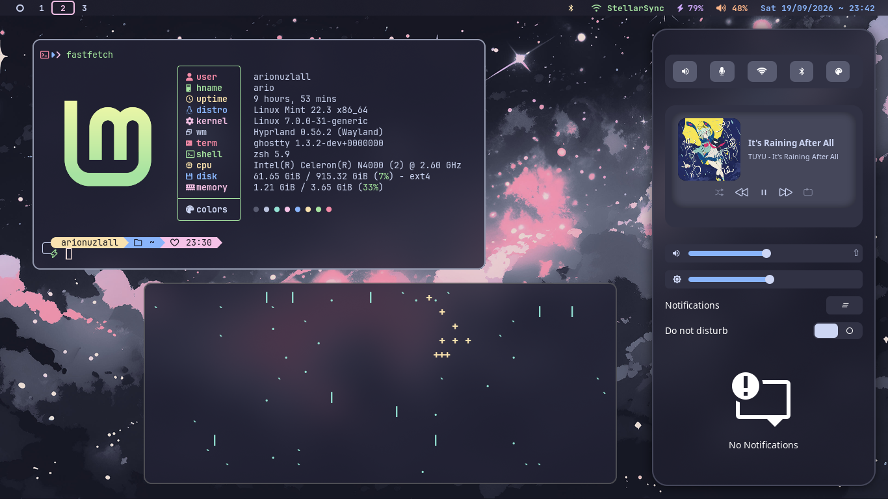

# MochaaNeko
MochaNeko is a cozy Catppuccin Mocha-inspired Hyprland dotfiles collection focused on simplicity, customization, and a cohesive desktop experience ✨.

It includes personal configurations for Hyprland, Waybar, Rofi, Kitty, SwayNC, Hyprlock, wallpaper management, shell tooling, and other desktop utilities. Clone the repository and adapt the configs to build your own setup.

<p align="center">
  
</p>

<p align="center">
  <a href="https://github.com/yoocandoit/MochaaNeko/commits">
  
  </a>

  <a href="https://github.com/yoocandoit/MochaaNeko/stargazers">
    
  </a>
  
  <a href="https://github.com/hyprwm/Hyprland">
  
</a>


</p>
  </a>
</p>

---

## 🧩 Components
This repository includes configuration for:
- **Window Managers**: `Hyprland`
- **Terminals**: `ghostty`
- **Shells**: `zsh`
- **Multiplexer**: `tmux`
- **Status Bar**: `waybar`
- **Notifications**: `swaync`
- **Launcher**: `rofi`
- **Logout menu**: `wlogout`
- **Audio visualizer**: `cava`

---

## 📦 Clone

Clone the repository:

```bash
git clone https://github.com/yoocandoit/MochaaNeko.git
cd MochaaNeko
```

> 💜 Feel free to customize the configs and make them your own.

---

### Screenshots
<table align="center">
  <tr>
    <td colspan="3">
       
      </a>
    </td>
  </tr>

  <tr>
    <td>
      
    </td>
    <td>
      
    </td>
    <td>
      
    </td>
  </tr>
</table>

---

## 📂 Structure

```plaintext
.
├── .config/
│   ├── cava/
│   ├── colors/         # Color schemes
│   ├── fastfetch/
│   ├── ghostty/
│   ├── kitty/
│   ├── hypr/
│   ├── rofi/
│   ├── swaync/
│   ├── arionuzlall/      # Personal scripts
│   ├── waybar/
│   └── wlogout/
├── meta/
│   ├── assets           # My Assets
├── .zshrc
├── LICENSE             # License
└── README.md           # This file
```
---

<p align="center">
  <i>“A little corner of my desktop, crafted with patience and a cup of mocha.”</i>
</p>

<p align="center">
  ☕ 🐈‍⬛ 🌙
</p>

<p align="center">
  Thanks for stopping by.<br>
  Feel free to explore, take inspiration, and make it your own.
</p>

<p align="center">
  <sub>Made with caffeine, curiosity, and too much time spent ricing.</sub>
</p>
